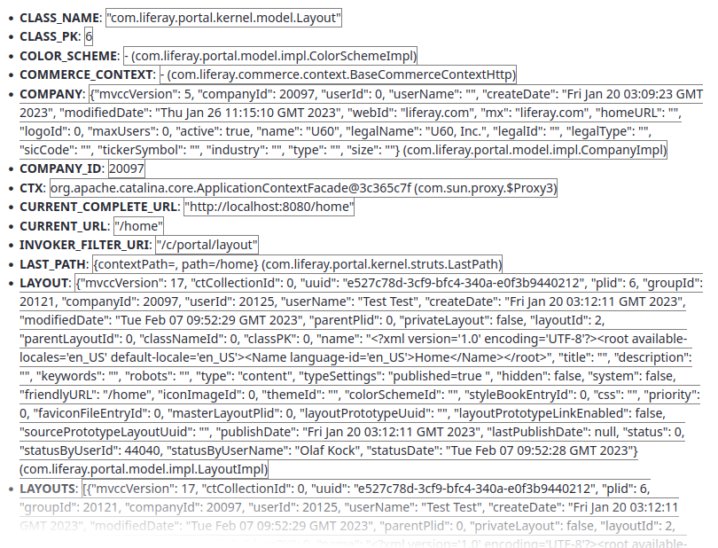

# Request Attribute Contributor Web

A quick POC to dump request attributes in a Liferay Template

## How to use

* Clone within a Liferay Workspace's module directory as `request-attribute-contributor-web`
* Compile
* Deploy
* Create a fragment, including styling according to your needs. (See below for a sample)
* Add fragment to any page

### Fragment sample HTML:

    

	    ${requestAttributes}
    

### Fragment sample CSS:

	.fragment_requestAttributes .attributeName {
		font-weight:bold;
	}
	.fragment_requestAttributes .attributeVisualization {
		border: 1px solid grey;
	}
	
### Fragment sample output:

